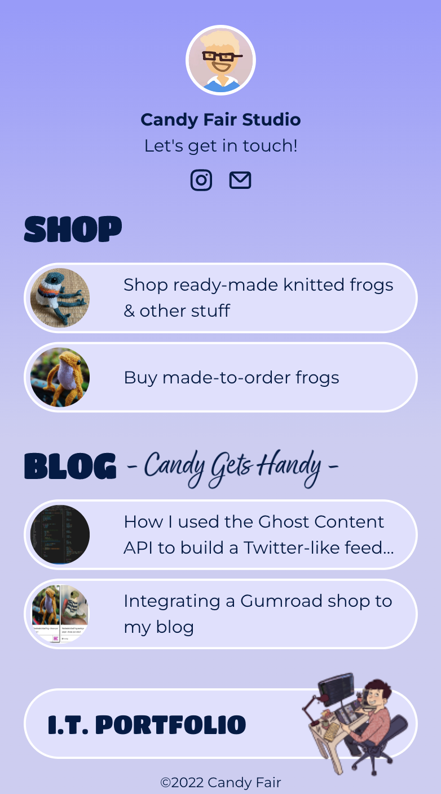

# Landing page with social links
I made this landing page for my [Instagram](https://www.instagram.com/candy.fair/) account, so I could easily redirect visitors to my online shop, my blog and my IT portfolio.

## Overview
### Screenshot

### Link
- Live site URL: [https://www.candyfairstudio.com](https://www.candyfairstudio.com)

## My process
This landing page is very simple so I mostly used HTML and CSS, after creating a mock-up on Figma.

A REST API fetches the 2 last articles published on my blog and uses their featured images as clickable vignette images.

The page is deployed on Vercel.

### Continued development
Right now the e-mail icon is not active. I will soon add a contact form so visitors can reach out to me. I haven't decided yet whether I'll use [Nodemailer](https://nodemailer.com/about/) or a front-end service like [EmailJS](https://www.emailjs.com).

## Author
- Website - [Candice Fairand Web Dev Portfolio](https://www.candicefairand.com)
- Blog - [Candy Gets Handy](https://www.candicefairand.com)
